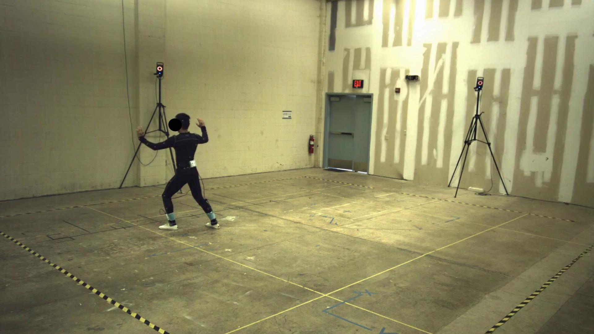
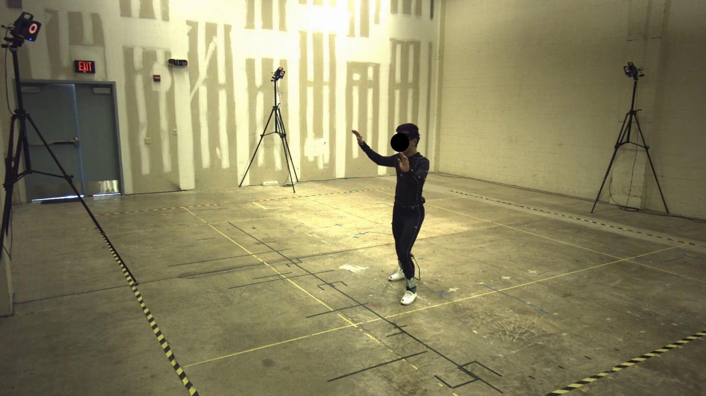
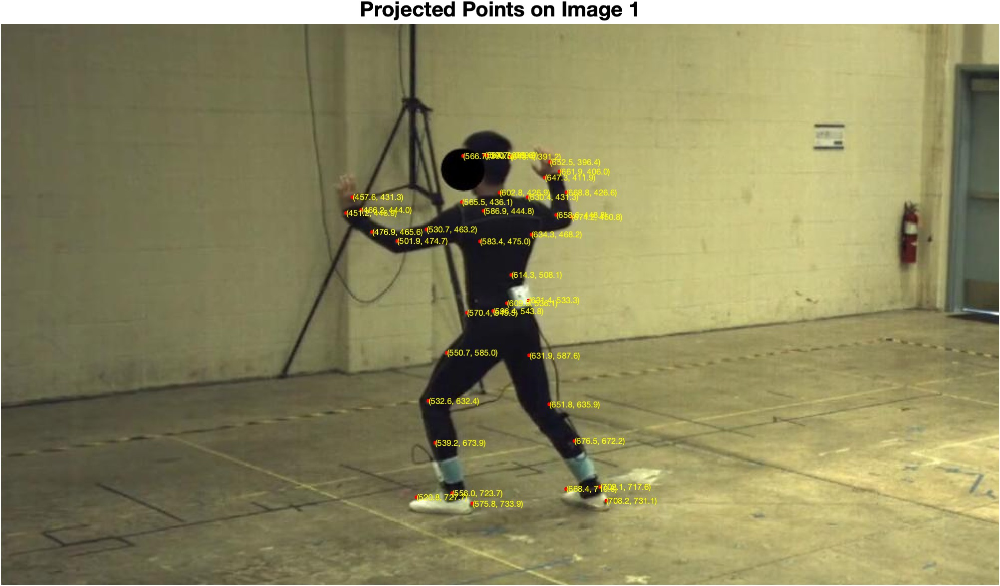
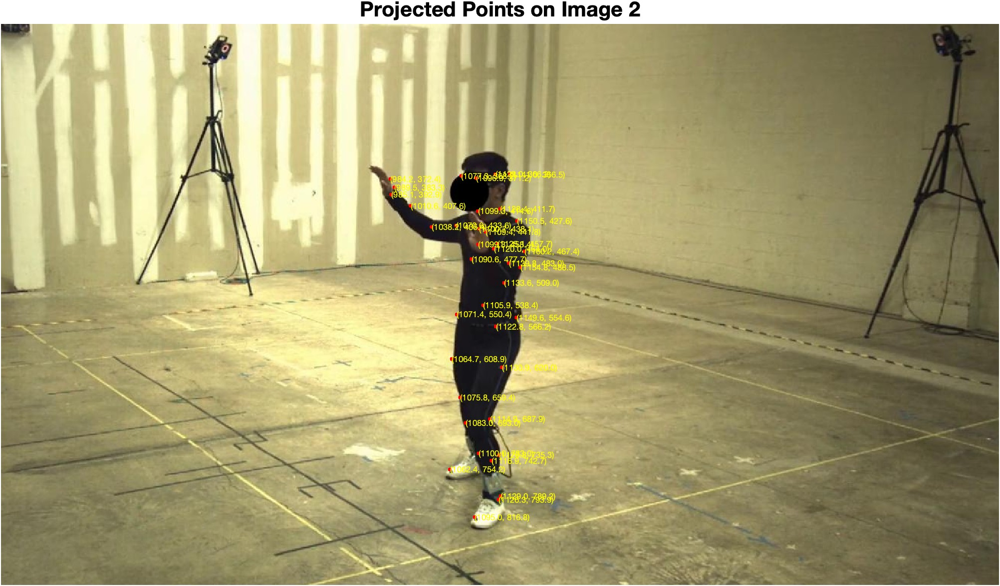
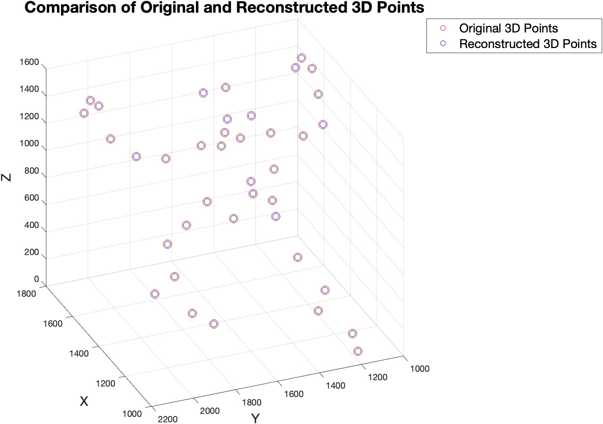
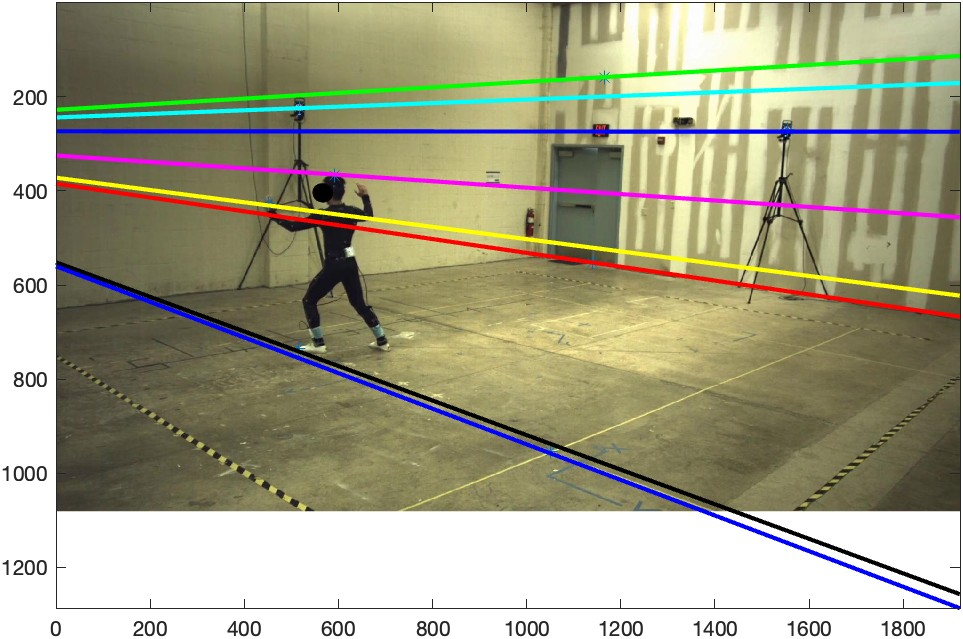
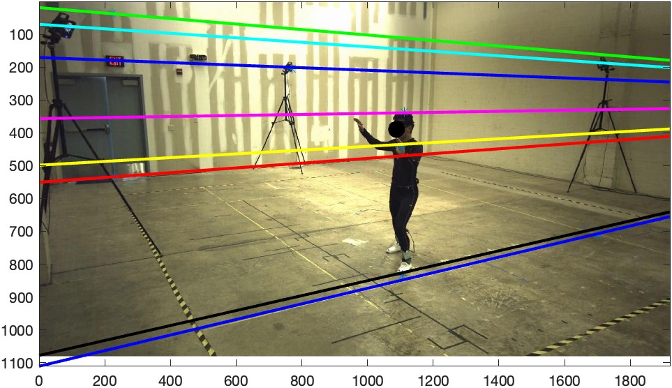
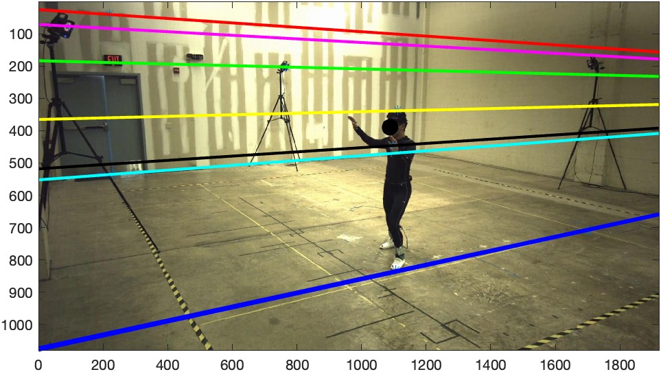
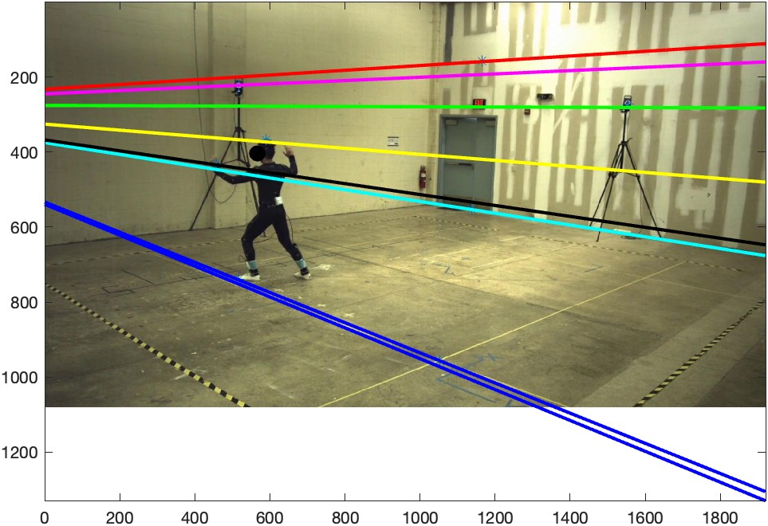
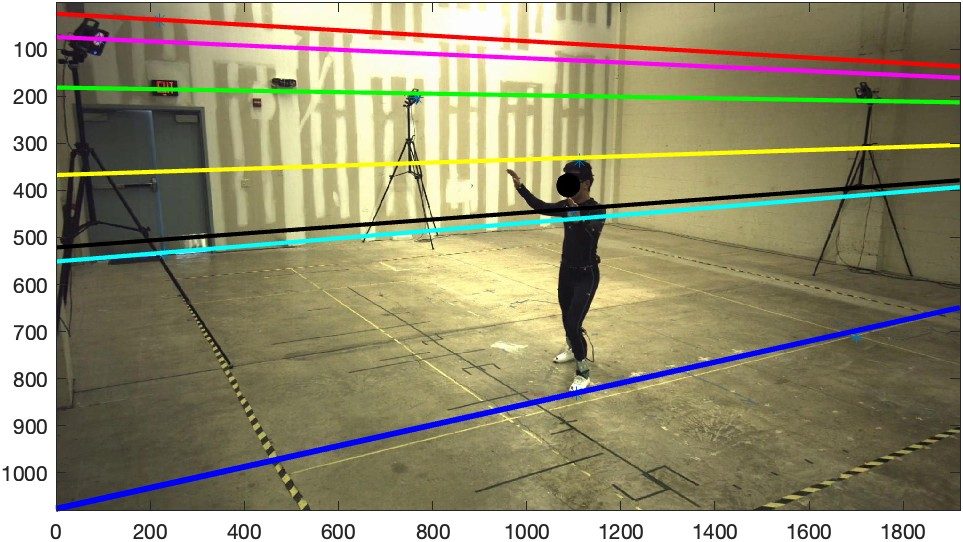

# Camera Projection, Triangulation, and Epipolar Geometry Project

### Complete paper for this project can be found [here](https://jasminekhalil.github.io/assets/pdf/camera_projection_project.pdf) 

This project provides a practical exploration of critical concepts in **camera projection, triangulation, and epipolar geometry**, fundamental topics in **computer vision** and **3D reconstruction.**

We used data provided from a **motion capture (Mocap) lab**, where a person performs a movement while wearing a suit with **infrared-reflecting markers.** These markers are tracked by an array of precisely **calibrated and synchronized** infrared cameras to generate accurate **3D point measurements.**

---

## Provided Data

1. Two images captured by two of the visible-light cameras representing views taken at precisely the same time, which had already been processed to remove non-linear radial lens distortion, making them ’corrected’ images.

2. Two Matlab files, one for each of the camera views containing the intrinsic parameters of the camera: focal length, principal point, aspect ratio, and skew, which combine to form the intrinsic matrix Kmat and the extrinsic parameters: camera position and rotation matrix Rmat which combine to form the projection matrix Pmat.
3. A Matlab file containing 3D point locations in world
coordinates of 39 markers on the performer’s body.

Using the provided intrinsic and extrinsic camera calibration parameters, which describe the cameras’ relationship to the 3D world, we understood the geometric relationship between the two camera views and how 3D structures are mapped into 2D images.

By working with real-world data and leveraging theoretical frameworks, this project bridges the gap between abstract mathematical concepts and their practical applications in fields such as robotics, augmented reality, and human motion analysis.

---

## Projecting 3D Mocap Points into 2D Pixel Locations using the **Pinhole Camera Model** 

 

---

## Recovering 3D Mocap Points from the Two Views to Create a **Reconstruction** of the Performer's Position

---

## Making **Measurments** about the Scene and Creating a **Reconstruction** of the Scene

---

## Using Fundamental Matrix from Known Camera Calibrations to Plot Epipolar Lines

## Using Fundamental Matrix from Eight-Point Algorithm with Hartley Preconditioning to Plot Epipolar Lines 

## Using Fundamental Matric from Eight-Point Algorithm without Hartley Preconditioning to Plot Epipolar Lines 

- **Email**: [jasminekhalil213@gmail.com](mailto:jasminekhalil213@gmail.com)  
- **LinkedIn**: [JasmineKhalil21](https://www.linkedin.com/in/jasminekhalil21/)